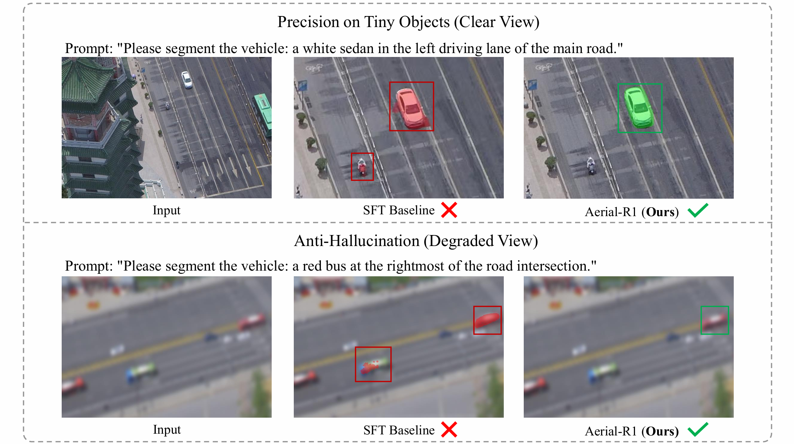

# Aerial-R1: Reinforcing Aerial Reasoning and Segmentation in MLLMs

[](https://anonymous.4open.science/r/Aerial-R1-5A43)
[]()


**Aerial-R1** is the first aerial MLLM framework designed to reinforce visual reasoning and reduce hallucination in aerial imagery. Drawing inspiration from reasoning-incentivizing mechanisms (like DeepSeek-R1), we introduce **Hybrid-View Group Relative Policy Optimization (H-GRPO)**. By enforcing consensus on high-resolution views and penalizing hallucinations on visually degraded views, Aerial-R1 learns an emergent refusal mechanism—knowing when to stay silent if visual evidence is ambiguous.


*(Figure 1 from the paper: Comparison of SFT Baseline vs. Aerial-R1 on tiny objects and hard negatives)*

## 🌟 Key Features

* **H-GRPO Strategy:** A self-supervised Reinforcement Learning paradigm that constructs dynamic groups of High-Res and Low-Res views to enforce visual consistency.
* **Emergent Refusal Mechanism:** Unlike SFT models that blindly guess, Aerial-R1 learns to output empty masks for ambiguous or absent targets, significantly reducing hallucinations.
* **VSAI-Ref Benchmark:** We introduce a comprehensive benchmark containing **5,372** referring segmentation samples and a dedicated **Hard Negative** subset (833 samples) to rigorously test model trustworthiness.
* **State-of-the-Art:** Achieves superior precision on tiny objects and eliminates hallucinations in low-information scenarios compared to Sa2VA and other SFT baselines.

## 📦 Model Checkpoints

We provide the **LoRA adapters** trained on the VSAI-Ref dataset.

**⚠️ Important Initialization Step:**
Our model is initialized from **Sa2VA** weights. Since Sa2VA does not distribute the single `.pth` file directly, you need to **convert/prepare** the base weights yourself.

1.  **Prepare Base Weights:**
    * Download the original Sa2VA weights (refer to [Sa2VA](https://huggingface.co/ByteDance/Sa2VA-InternVL3-2B)).
    * Convert them to get `Sa2VA-InternVL3-2B.pth` (using the conversion script provided in `tools/` or following Sa2VA's guidelines).
    * Set `pretrained_pth = "/path/to/your/Sa2VA-InternVL3-2B.pth"` in your config file.

2.  **Load Our Checkpoint:**
    * Load our provided `aerial-r1-hgrpo.pth` (LoRA weights) **on top of** the base weights.

| Model | Stage | Initialization | Description | Path |
| :--- | :--- | :--- | :--- | :--- |
| **Aerial-R1-Final** | Stage 2 (H-GRPO) | Sa2VA-InternVL3-2B | **(Ours)** The final model aligned via H-GRPO. | `checkpoints/aerial-r1-hgrpo.pth` |


## 📂 Data Preparation

We construct the **VSAI-Ref** benchmark based on the VSAI dataset. 
Due to the large scale of the dataset and the double-blind review policy, the full processed dataset and annotations will be **released publicly upon acceptance**.

Currently, the codebase provides the complete model architecture and training logic for inspection.

## 🚀 Training

Training involves two stages: Supervised Fine-Tuning (SFT) warm-up and Reinforcement Learning (H-GRPO).

### Stage 1: Supervised Fine-Tuning

```
bash tools/dist.sh train projects/configs/sft.py 4
```

### Stage 2: Hybrid-View GRPO (RL)

This stage enables the **Hybrid-View Sampling** and **Dual-Branch Reward**.

```
bash tools/dist.sh train projects/configs/h_grpo.py 4
```


## 📊 Evaluation

To reproduce the results in **Table 2**:

### 1. Specific Referring Segmentation

Evaluate metrics on the standard test set.

```bash
python ./eval/eval_vsai_ref_task1.py --work-dir ./results/Aerial_r1_task1

```

### 2. General Referring Segmentation

Evaluate metrics on the standard test set.

```bash
python ./eval/eval_vsai_ref_task2.py --work-dir ./results/Aerial_r1_task2

```


## 📄 License

This project is released under the MIT License.
