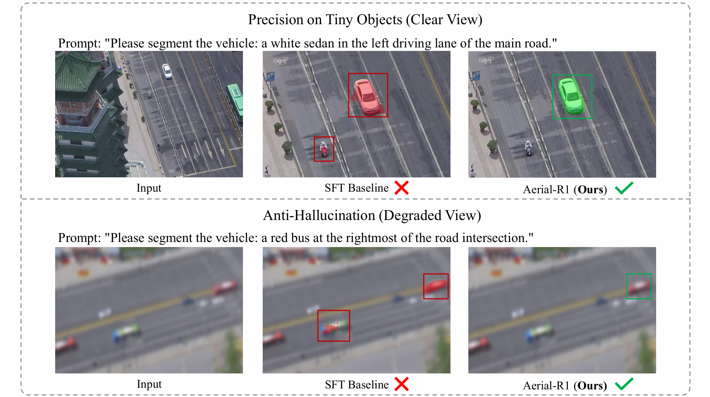

# Aerial-R1: Reinforcing Aerial Reasoning and Segmentation in MLLMs
[]()

**Aerial-R1** is the first aerial MLLM framework designed to reinforce visual reasoning and mitigate object hallucination in aerial imagery. Drawing inspiration from reasoning-incentivizing mechanisms (like DeepSeek-R1), we introduce **Hybrid-View Group Advantage-Weighted Regression (H-GAWR)**. By enforcing consensus on high-resolution views and strictly penalizing hallucinations on visually degraded views, Aerial-R1 develops an explicitly incentivized refusal mechanism—knowing when to stay silent if visual evidence is ambiguous.


*(Figure 1 from the paper: Qualitative comparison of SFT Baseline vs. Aerial-R1 on tiny objects and hard negatives.)*

## 🌟 Key Features

* **H-GAWR Optimization:** A self-supervised Reinforcement Learning paradigm that constructs dynamic groups of High-Res and Low-Res views to enforce visual consistency without destabilizing the non-autoregressive mask decoder.
* **Explicit Refusal Mechanism:** Unlike standard SFT models that blindly guess, Aerial-R1 learns to explicitly output empty masks for ambiguous or absent targets, significantly suppressing language-driven hallucinations.
* **VSAI-Ref Benchmark:** We introduce the first comprehensive multi-task aerial benchmark containing **5,372** referring segmentation samples and a dedicated **Hard Negative** subset (832 samples) to rigorously test model trustworthiness and cognitive safety boundaries.
* **State-of-the-Art Precision:** Achieves superior grounding precision on tiny objects while boosting the successful refusal rate to over 61% in low-information scenarios compared to highly-optimized SFT baselines.

## 📦 Model Checkpoints

We provide the **LoRA adapters** trained on the VSAI-Ref dataset, including our final model and the comparative baselines mentioned in the paper.

**⚠️ Important Initialization Step:**
Our model is built upon the **Sa2VA** architecture (InternVL-Chat-V1.5 + SAM-2). Since Sa2VA does not distribute the single `.pth` file directly, you need to **prepare** the base weights yourself before applying our LoRA weights.

1.  **Prepare Base Weights:**
    * Download the original Sa2VA weights (refer to [Sa2VA](https://huggingface.co/ByteDance/Sa2VA-InternVL3-2B)).
    * Convert them to get `Sa2VA-InternVL3-2B.pth` (using the conversion script provided in `tools/` or following Sa2VA's guidelines).
    * Set `pretrained_pth = "/path/to/your/Sa2VA-InternVL3-2B.pth"` in your config file.

2.  **Load Our Checkpoints:**
    * Load the provided LoRA weights (`.pth` files) **on top of** the base weights depending on the stage you want to evaluate.

| Model | Stage | Initialization | Description | Path |
| :--- | :--- | :--- | :--- | :--- |
| **Aerial-R1 (H-GAWR)** | Stage 2 | Sa2VA-InternVL3-2B | **(Ours)** The final robust model aligned via H-GAWR. | `checkpoints/h_gawr.pth` |
| **Sa2VA (SFT)** | Stage 1 | Sa2VA-InternVL3-2B | The standard SFT baseline without reinforcement learning. | `checkpoints/sft.pth` |
| **Sa2VA (SFT + Low-Res)** | Stage 1 | Sa2VA-InternVL3-2B | The naive augmentation baseline trained with low-res inputs. | `checkpoints/sft_l.pth` |

## 📂 Data Preparation

We construct the **VSAI-Ref** benchmark based on the original VSAI dataset. 
The fully processed multi-task dataset, including the specific referring segmentation samples, VQA pairs, scene descriptions, and the dedicated Hard Negative subset, is now **publicly available**.

You can download the complete VSAI-Ref benchmark from Hugging Face:
* [🔗 Download VSAI-Ref Dataset](https://huggingface.co/datasets/phy9178/VSAI-Ref)

## 🚀 Training

Training Aerial-R1 involves two phases: Supervised Fine-Tuning (SFT) warm-up and Advantage-Weighted Regression (H-GAWR).

### Stage 1: Supervised Fine-Tuning (SFT)

```bash
bash tools/dist.sh train projects/configs/sft.py 4
```

### Stage 2: Supervised Fine-Tuning (SFT)

```bash
bash tools/dist.sh train projects/configs/h_gawr_blur.py 4